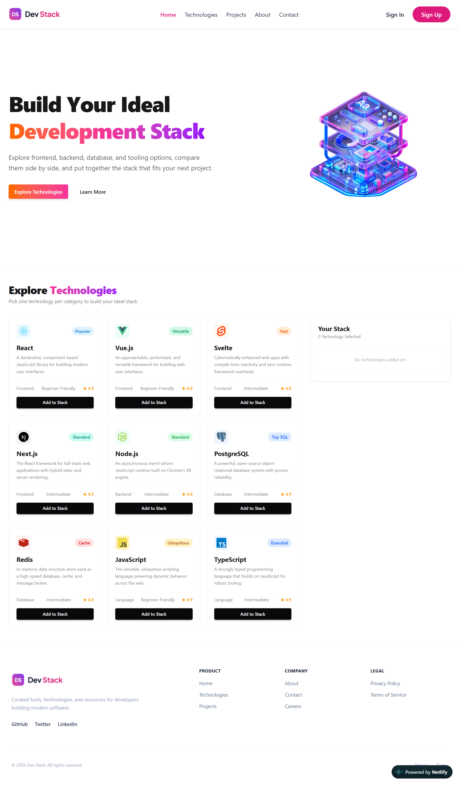

# DevStack Builder

A simple React application where you can browse popular development technologies and build your own personalized "tech stack" by adding and removing them from a list.

🔗 **Live Site:** [https://my-devstack-builder.netlify.app/](https://my-devstack-builder.netlify.app/)
📦 **Repository:** [ridumondol/assignment-5](https://github.com/ridumondol/assignment-5)

## 📖 About the Project

DevStack Builder lets you explore a curated list of technologies (frameworks, libraries, languages, and tools), view details about each one, and add your favorites to a personal "Your Stack" panel. It's built as part of a front-end development assignment focused on React fundamentals: components, props, and state.
## 📸 Project Screenshot



## ✨ Features

- **Explore Technologies** — Browse a list of technologies, each shown as a card with its name, description, category, and other details.
- **Build Your Stack** — Add any technology to your personal stack with one click.
- **Remove Items** — Remove a single technology from your stack, or clear the entire stack at once.
- **Duplicate Prevention** — Once a technology is added, its "Add" button is disabled so it can't be added twice.
- **Responsive Design** — Adapts cleanly across mobile, tablet, and desktop screen sizes.

## 🛠️ Tech Stack

- **React** — for building the user interface with reusable components
- **JavaScript (ES6+)** — core application logic
- **CSS / Tailwind CSS** — styling and responsive layout
- **Vite** — fast development server and build tool
- **Netlify** — deployment and hosting

## 🚀 Getting Started

### Prerequisites

- [Node.js](https://nodejs.org/) (v18 or later recommended)
- npm (comes with Node.js)

### Installation

1. Clone the repository
   ```bash
   git clone https://github.com/ridumondol/assignment-5.git
   ```
2. Navigate into the project directory
   ```bash
   cd assignment-5
   ```
3. Install dependencies
   ```bash
   npm install
   ```
4. Start the development server
   ```bash
   npm run dev
   ```
5. Open the local URL shown in your terminal (usually `http://localhost:5173`) in your browser.

## 📁 Project Structure

```
assignment-5/
├── src/
│   ├── components/     # Reusable UI components (cards, stack panel, navbar, etc.)
│   ├── data/            # Technology data used to populate the app
│   ├── App.jsx          # Root component and main state management
│   └── main.jsx         # Application entry point
├── public/               # Static assets
├── package.json
└── README.md
```

> Note: This structure is a general guide — update it to match the actual folders and files in your project.

## 🎯 What I Learned

- How to manage shared state (`useState`) and lift it up between parent and child components.
- How to pass data down via props and handle events (like add/remove) back up via callback functions.
- How to conditionally render UI based on state (e.g., disabling a button once an item is added).
- How to structure a responsive layout using CSS/Tailwind for different screen sizes.

## 📄 License

This project was built for educational purposes as part of a course assignment.

## 🙋 Author

**ridumondol**
GitHub: [@ridumondol](https://github.com/ridumondol)

